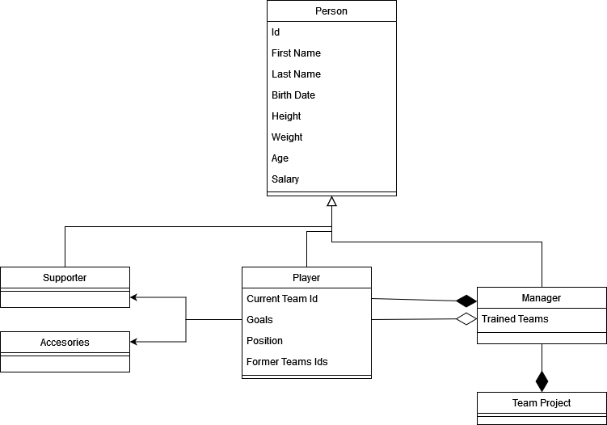

# Football Management
## Main Program

<details>
<summary>Program.cs</summary>
<br>
  
```csharp
using System;
using OOP_Fundamentals.Tasks;
using System.Collections.Generic;
using System.Text;

namespace OOP_Fundamentals
{
    class Program
    {
        static void Main(string[] args)
        {

            // Initialization
            List<string> teams = new List<string>();
            teams.Add("Real Madrid"); teams.Add("Atletico Madrid"); teams.Add("FC Barcelona");

            List<Player> players = new List<Player>();


            players.Add(new Player("Real Madrid", 20, teams));
            players.Add(new Player("PSG", 20, teams));
            players.Add(new Player("Man UTD", 20, teams));

            // Set players names
            players[0].Name = "Eden Hazard";
            players[1].Name = "Lionel Messi";
            players[2].Name = "Cristiano Ronaldo";

            Console.WriteLine("Former team for a player\n-------------------------- ");
            Console.WriteLine(players[0].FormerTeams[1]);
            Console.WriteLine("\n\n\n");

            // <------ ASSOCIATION ------ > 

            // Association (player - accessories)
            Accessories accessories = new Accessories();

            players[1].playerBL.Equip(accessories);
            accessories.Link_With(players[1]);


            // Association (player - supporter)
            Supporter supporter = new Supporter();

            Console.WriteLine("Status between player and supporter\n------------------------------------");
            Console.WriteLine(supporter.GetStatus(players[1]));
            Console.WriteLine(players[1].playerBL.GetStatus(supporter));
            Console.WriteLine("\n\n\n");


            // <------ AGGREGATION ------ > 

            // Aggregation (manager - player)
            Manager manager = new Manager();
            foreach (Player player in players)
                manager.players.Add(player);

            Console.WriteLine("Show all players linked to this manager\n---------------------------------------");
            manager.ShowPlayersNames(); // show all players names linked with this manager


            // <------ COMPOSITION ------ > 

            // Composition (manager - team_project)
            
            
            Manager manager1 = new Manager();
            manager1.Name = "Luis Enrique";
            manager1.BirthDate = new DateTime(2002, 12, 2);
            manager1.Wage = 500;


            Console.WriteLine("\n\n\n");

            Console.WriteLine("If the team project is unsuccessful, then the manager wage will decrease\n---------------------------------------------------------------------------");
            manager1.ManagerStatus(false);
            manager1.ManagerStatus(false);

            Console.WriteLine(manager1.Wage);


        }

        

    }
}

```
</details>
  
## Classes

<details>
  <p><br> Aceasta clasa contine alte clase care mostenesc proprietatile clasei "Person". Aceste clase sunt : Player, Manager, Supporter </p>
<summary>Person.cs</summary>
<br>
  
```csharp
using System;
using System.Collections.Generic;
using System.Text;

namespace OOP_Fundamentals.Tasks
{


    public abstract class Person
    {


        // Properties
        public string Name { get; set; }
        public DateTime BirthDate { get; set; }
        public int Wage { get; set; }

        // Constructor of class "Person" without params
        public Person() { }

        // Constructor of class "Person" with 3 params
        public Person(string name, DateTime birthDate, int wage)
        {
            this.Name = name;
            this.BirthDate = birthDate;
            this.Wage = wage;
        }

    }

    // Player interface 
    interface IPlayer
    {
        void Equip(Accessories accessories);
        bool GetStatus(Supporter supporter);
    }

    // Player class (The Player IS A type of Person)
    public class Player : Person
    {
        // Properties
        public string CurrentTeam { get; set; }
        public int Goals { get; set; }
        public List<string> FormerTeams { get; set; }

        public PlayerBL playerBL;

        // Constructor of class "Player" with 1 param
        public Player() 
        {
            this.playerBL = new PlayerBL();
        }

        // Constructor of class "Player" with BL params
        public Player(PlayerBL iplayer)
        {
            this.playerBL = iplayer;
        }
        
        // Constructor of class "Player" with 3 params
        public Player(string currentTeam, int goals, List<string> formerTeams)
        {
            this.playerBL = new PlayerBL();
            this.CurrentTeam = currentTeam;
            this.Goals = goals;
            this.FormerTeams = formerTeams;
        }

    }

    // PlayerBL class (BL for Player)
    public class PlayerBL : IPlayer
    {
        public PlayerBL() { }

        // ASSOCIATION
        public void Equip(Accessories accessories)
        {
            // some code
        }

        // Relationship with supporter
        public bool GetStatus(Supporter supporter)
        {
            return true;
        }


    }

    // Manager class (The Manager IS A type of Person)

    public class Manager : Person
    {
        // Properties
        public List<string> TrainedTeams { get; set; }
        private readonly Team_Project _project;

        // Constructor of class "Manager" without params
        public Manager() 
        {
            this._project = new Team_Project(this);
        }


        // Constructor of class "Manager" with 1 param

        public Manager(List<string> trainedTeams)
        {
            this.TrainedTeams = trainedTeams;
        }

        // AGGREGATION (manager - player)
        public List<Player> players = new List<Player>();

        public void ShowPlayersNames()
        {
            foreach(Player player in players)
                Console.WriteLine(player.Name);
        }

        // COMPOSITION (manager status)

        public void ManagerStatus(bool state)
        {
            if (state == true)
                this._project.IsProsperous = true;
            else
                this._project.IsProsperous = false;
        }
        

    }

    // Supporter class (The Supporter IS A type of Person)
    public class Supporter : Person
    {
        // Properties
        public string FavoriteTeam { get; set; }

        // Constructor of class "Supporter" without params
        public Supporter() { }

        // Constructor of class "Supporter" with 1 param
        public Supporter(string favoriteTeam)
        {
            this.FavoriteTeam = favoriteTeam;
        }

        // Relationship with player
        public bool GetStatus(Player player)
        {
            return true;
        }

    }
}


```
</details>
  
<details>
  <p><br> Clasa curenta se afla intr-o relatie de asociere cu clasa "Player" si va contine diverse accesorii pe care le va avea un jucator, dar si anumite skill-uri ale acestuia </p>
<summary>Accessories.cs</summary>
<br>
  
```csharp
using System;
using System.Collections.Generic;
using System.Text;

namespace OOP_Fundamentals.Tasks
{
    public class Accessories
    {

        // Constructor of class "Accessories" without params
        public Accessories() { }


        // Association with PLAYER
        public void Link_With(Person person)
        {
            // some code
        }

    }
}
```
</details>
  
<details>
  <p><br> Clasa curenta se afla intr-o relatie de compozitie cu clasa "Manager", ceea ce inseamna ca : daca manager-ul face performanta cu echipa, atunci proiectul echipei va evolua, iar daca proiectul echipei evolueaza situatia manager-ului va fi una buna la echipa </p>
<summary>Team_Project.cs</summary>
<br>
  
```csharp
using System;
using System.Collections.Generic;
using System.Text;

namespace OOP_Fundamentals.Tasks
{


    public class Team_Project
    {
        // Properties

        private readonly Manager _manager;
        private bool isprosperous = false;

        public bool IsProsperous 
        {
            get { return isprosperous; }
            set 
            {
                isprosperous = value;

                if (value)
                    _manager.Wage += 1;
                else
                    _manager.Wage -= 1;
            } 
        }
       

        // Constructor of class "Team_Project" without params
        public Team_Project() {}

        // Constructor of class "Team_Project" with 1 param
        public Team_Project(Manager manager)
        {
            _manager = manager;
        }

    }
}

```
</details>


## UML Diagram
  
  
